# AI工具箱 V2.0 项目完整技术文档

> 文档版本：V2.0  
> 项目定位：面向办公场景的 AI 效率工具平台  
> 已上线域名：https://aiworkbox.cn  
> 代码基准：当前项目目录 `D:\AI工具箱`  
> 说明：本文档基于当前代码结构、Prisma schema、Next.js API Route、前端组件和已完成验收记录整理，不包含任何 API Key、Token、数据库连接串或密码。

---

## 第一章 项目概述

AI工具箱是一个面向办公场景的 AI 效率工具平台。项目目标是把常见办公任务封装成可直接使用的 AI 工具，让普通用户不需要理解提示词工程、Dify Workflow、模型参数或接口调用细节，也能通过网页完成 Excel 分析、PDF 总结、合同提取、周报生成、PPT 大纲生成、会议纪要整理、邮件润色和电商文案生成等任务。

项目当前对外域名为：

```text
https://aiworkbox.cn
```

从产品定位上看，它不是一个纯演示站点，而是一个已经具备用户系统、数据库、邮箱找回密码、联系表单、飞书同步、Dashboard、管理员后台、免费次数和套餐模型的轻量 SaaS 产品。用户访问网站后，可以注册账号、登录、使用工具、查看自己的额度和使用记录；站点管理员可以查看用户、联系表单、使用记录、订单和套餐数据，并可手动为用户开通套餐。

### 1.1 项目为什么做

办公场景里有大量重复、低创造性但又耗时的工作，例如：

- 看 Excel 表格并整理核心结论。
- 阅读 PDF 并总结重点。
- 从合同里提取主体、金额、期限、违约责任和风险点。
- 根据工作内容生成日报、周报或月报。
- 根据主题生成 PPT 大纲。
- 根据会议文本整理会议纪要和待办事项。
- 把邮件、通知、公文或沟通内容润色成更合适的语气。
- 根据商品、卖点或活动要求生成电商文案。

这些任务本身非常适合由大模型处理，但普通用户直接使用大模型时会遇到几个问题：

- 不知道该怎么写提示词。
- 不知道如何上传和处理文件。
- 不知道如何把不同任务拆成工作流。
- 不知道结果是否有结构化输出。
- 没有统一的使用记录、额度和账号体系。

AI工具箱的价值就是把这些能力产品化：用户只看见工具入口、表单、上传框和结果区，背后由 Next.js API、Dify Workflow、数据库和配套安全体系完成任务编排。

### 1.2 项目演进

#### V1.0

V1.0 主要完成从 Dify 工作流到独立网站的产品化，包括：

- 7 个 AI 办公工具。
- 用户注册登录。
- 联系定制页面。
- 飞书多维表格同步。
- Dify Workflow 调用链路。
- 基础额度与使用提示。

V1.0 解决的是“能不能用”的问题。

#### V2.0

V2.0 重点解决“能不能作为产品运营和变现”的问题，包括：

- 用户中心 Dashboard。
- PostgreSQL + Prisma 持久化用户数据。
- Resend 邮箱验证码找回密码。
- Admin 管理员后台。
- 每个工具首次免费体验。
- 套餐系统数据模型。
- 订单数据模型。
- 管理员手动开通套餐。
- CSV 导出。
- AuditLog 审计日志。
- RateLimitEvent 限流事件。
- 登录、注册、忘记密码、验证码验证限流。
- 生产环境 `AUTH_SESSION_SECRET` 强校验。

V2.0 的核心变化是：网站从工具集合升级为有账号、有数据、有安全、有运营后台、有变现路径的产品。

---

## 第二章 技术栈

### 2.1 前端技术栈

| 技术 | 当前用途 |
| --- | --- |
| Next.js 16.2.6 | App Router、页面路由、API Route、生产构建 |
| React 18.3.1 | 页面组件和交互状态 |
| TypeScript 5.6.3 | 类型约束、API 数据结构和组件 props |
| Tailwind CSS 3.4.15 | 页面样式、响应式布局、工具类 CSS |
| lucide-react | 图标按钮和界面图标 |
| react-markdown | AI 结果 Markdown 渲染 |
| remark-gfm / rehype-highlight / highlight.js | Markdown 扩展、代码高亮 |

主要前端组件包括：

- `components/SiteHeader.tsx`
- `components/AuthPageClient.tsx`
- `components/ForgotPasswordPageClient.tsx`
- `components/ResetPasswordPageClient.tsx`
- `components/GenericToolPageClient.tsx`
- `components/OfficeToolboxClient.tsx`
- `components/DashboardClient.tsx`
- `components/AdminPageClient.tsx`
- `components/ContactPageClient.tsx`
- `components/PricingPageClient.tsx`

### 2.2 后端技术栈

后端使用 Next.js Route Handlers 实现，不单独部署 Express、NestJS 或其他后端服务。所有后端接口都位于：

```text
app/api/*
```

核心接口包括：

- `/api/auth/register`
- `/api/auth/login`
- `/api/auth/logout`
- `/api/auth/me`
- `/api/auth/forgot-password`
- `/api/auth/reset-password`
- `/api/toolbox/office`
- `/api/contact`
- `/api/dashboard/summary`
- `/api/usage-records`
- `/api/usage-records/export`
- `/api/admin/summary`
- `/api/admin/export`
- `/api/admin/subscriptions/grant`
- `/api/admin/users/[userId]/usage`
- `/api/payment/create-order`
- `/api/payment/webhook`

### 2.3 数据库技术栈

| 技术 | 当前用途 |
| --- | --- |
| PostgreSQL | 生产数据库 |
| Neon | PostgreSQL 托管服务 |
| Prisma 5.22.0 | ORM、schema、migration、类型化数据库访问 |
| `@prisma/client` | 服务端数据库读写 |

数据库连接由 Prisma 的 datasource 读取：

```prisma
datasource db {
  provider = "postgresql"
  url      = env("DATABASE_URL")
}
```

注意：Prisma 只读取 `DATABASE_URL`。如果 Vercel Preview 环境要连接 Neon Preview 分支，需要在 Vercel Preview 环境里配置同名变量 `DATABASE_URL` 指向 Preview 数据库，而不是依赖 `DATABASE_URL_PREVIEW` 自动生效。

### 2.4 AI 能力

| 技术 | 当前用途 |
| --- | --- |
| Dify Workflow | 统一承接 7 个工具的工作流编排 |
| DeepSeek API | 当前项目代码侧未直接调用；模型能力应在 Dify Workflow 内配置 |

项目侧调用 Dify 的核心文件：

- `lib/dify.ts`
- `app/api/toolbox/office/route.ts`

当前工具统一走 `TOOLBOX_OFFICE_API_KEY` 和 `DIFY_BASE_URL`，而不是每个工具独立维护一个 Dify Key。

### 2.5 邮件系统

| 技术 | 当前用途 |
| --- | --- |
| Resend | 找回密码验证码邮件发送 |

涉及环境变量：

- `EMAIL_PROVIDER`
- `EMAIL_FROM`
- `RESEND_API_KEY`
- `NEXT_PUBLIC_APP_URL`

当前已完成 Resend 域名验证，密码重置邮件发送已实际跑通。

### 2.6 表单管理

| 技术 | 当前用途 |
| --- | --- |
| 飞书多维表格 | 收集联系定制需求 |
| Next.js API Route | 中转、校验、写入飞书和本地数据库 |

涉及环境变量：

- `FEISHU_APP_ID`
- `FEISHU_APP_SECRET`
- `FEISHU_BASE_APP_TOKEN`
- `FEISHU_TABLE_ID`，可选

`FEISHU_TABLE_ID` 未配置时，后端会通过飞书“列出数据表”API 获取第一张表的 `table_id`。

### 2.7 部署

| 技术 | 当前用途 |
| --- | --- |
| Vercel | Next.js 生产部署 |
| aiworkbox.cn | 正式域名 |
| Neon | 生产数据库 |
| Resend | 生产邮件 |
| 飞书开放平台 | 联系表单写入 |

---

## 第三章 系统架构图

### 3.1 总体架构

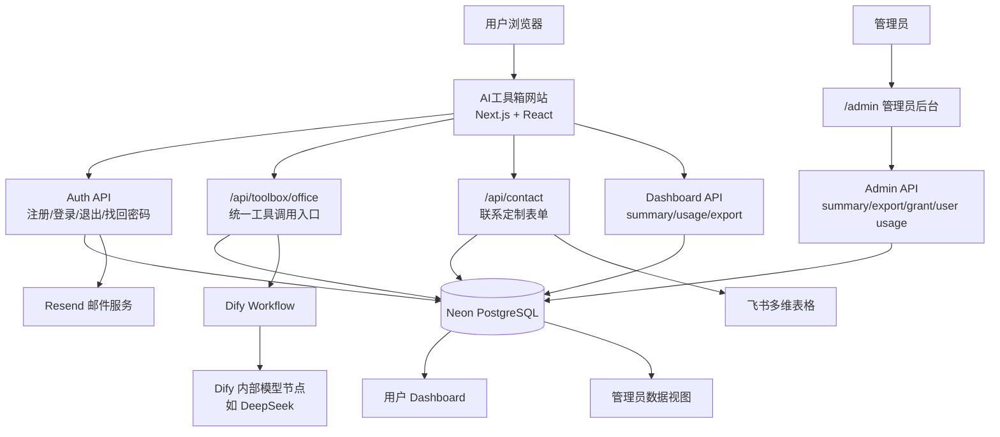

### 3.2 运行时分层

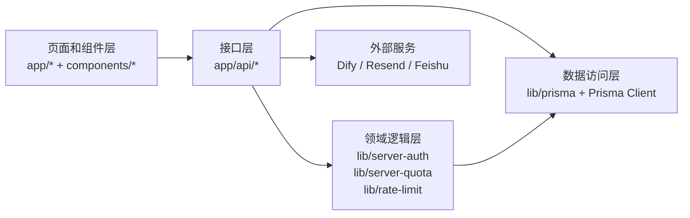

---

## 第四章 用户系统架构

### 4.1 用户系统组成

用户系统由以下部分组成：

- 注册接口：`app/api/auth/register/route.ts`
- 登录接口：`app/api/auth/login/route.ts`
- 退出接口：`app/api/auth/logout/route.ts`
- 当前用户接口：`app/api/auth/me/route.ts`
- 忘记密码接口：`app/api/auth/forgot-password/route.ts`
- 重置密码接口：`app/api/auth/reset-password/route.ts`
- 服务端认证逻辑：`lib/server-auth.ts`
- 前端登录注册页面：`components/AuthPageClient.tsx`
- 忘记密码页面：`components/ForgotPasswordPageClient.tsx`
- 重置密码页面：`components/ResetPasswordPageClient.tsx`

### 4.2 注册

用户注册时，后端会：

1. 校验邮箱格式。
2. 校验密码长度。
3. 校验两次密码一致。
4. 使用 bcrypt 对密码加密。
5. 创建 `users` 记录。
6. 创建 `user_quotas` 记录。
7. 创建 httpOnly session cookie。
8. 写入 `AuditLog`：`auth.register.success`。

注册接口还接入了限流：

- 同 IP 10 分钟最多 5 次。
- 同邮箱 10 分钟最多 3 次。
- 超限写入 `auth.register.rate_limited` 审计日志。

### 4.3 登录

登录时，后端会：

1. 校验邮箱和密码。
2. 查询 `users`。
3. 使用 bcrypt 校验密码 hash。
4. 根据“记住我”生成不同有效期的 cookie。
5. 写入 `auth.login.success` 或 `auth.login.failed`。

Session cookie 名称为：

```text
office_ai_session
```

Cookie 特性：

- `httpOnly`
- `sameSite: lax`
- `path: /`
- 生产环境 `secure: true`
- 未勾选记住我：1 天有效期
- 勾选记住我：30 天有效期

### 4.4 角色权限

当前 `users` 表包含：

```text
role
```

默认值为：

```text
user
```

管理员为：

```text
admin
```

管理员后台相关接口都会通过 `getCurrentServerUser()` 获取当前用户，并校验 `role === "admin"`。普通用户访问管理员接口会返回 403。

### 4.5 用户系统流程图

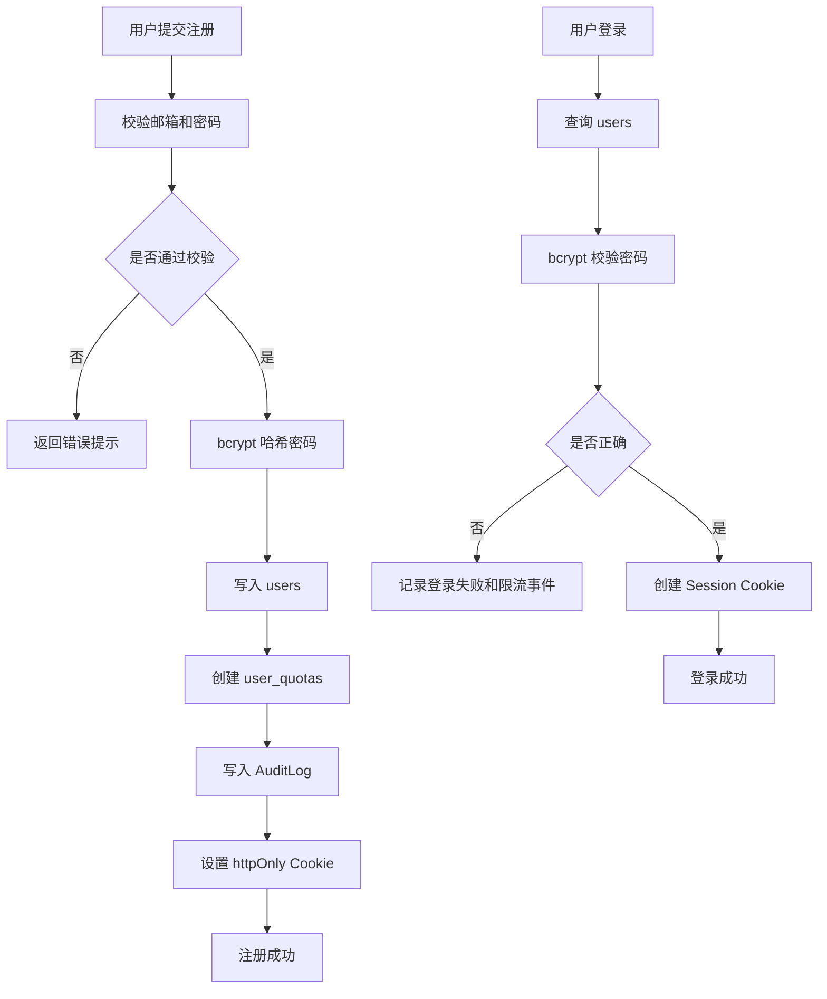

---

## 第五章 邮件系统

### 5.1 邮件系统定位

邮件系统用于忘记密码和重置密码流程。当前采用 Resend 发送 6 位数字验证码。项目不在前端生成验证码，也不把验证码明文存入数据库。

相关文件：

- `lib/email.ts`
- `app/api/auth/forgot-password/route.ts`
- `app/api/auth/reset-password/route.ts`
- `components/ForgotPasswordPageClient.tsx`
- `components/ResetPasswordPageClient.tsx`

### 5.2 环境变量

生产环境需要配置：

```text
EMAIL_PROVIDER=resend
EMAIL_FROM=
RESEND_API_KEY=
NEXT_PUBLIC_APP_URL=https://aiworkbox.cn
```

只应配置变量值，不应把密钥写入代码或文档。

### 5.3 Resend 接入过程

当前项目采用 Resend 域名发信模式。生产可用前需要完成：

1. 在 Resend 添加发信域名 `aiworkbox.cn`。
2. 在域名 DNS 服务商处配置 Resend 给出的 DKIM、SPF、MX 等记录。
3. 回到 Resend 控制台点击 Verify Domain。
4. Vercel 配置 `RESEND_API_KEY` 和 `EMAIL_FROM`。
5. 重新部署或触发生产环境读取新变量。

实际验收中，Resend `POST /emails` 返回 200，QQ 邮箱能收到验证码，验证码正确后可以重置密码并使用新密码登录。

### 5.4 密码找回流程

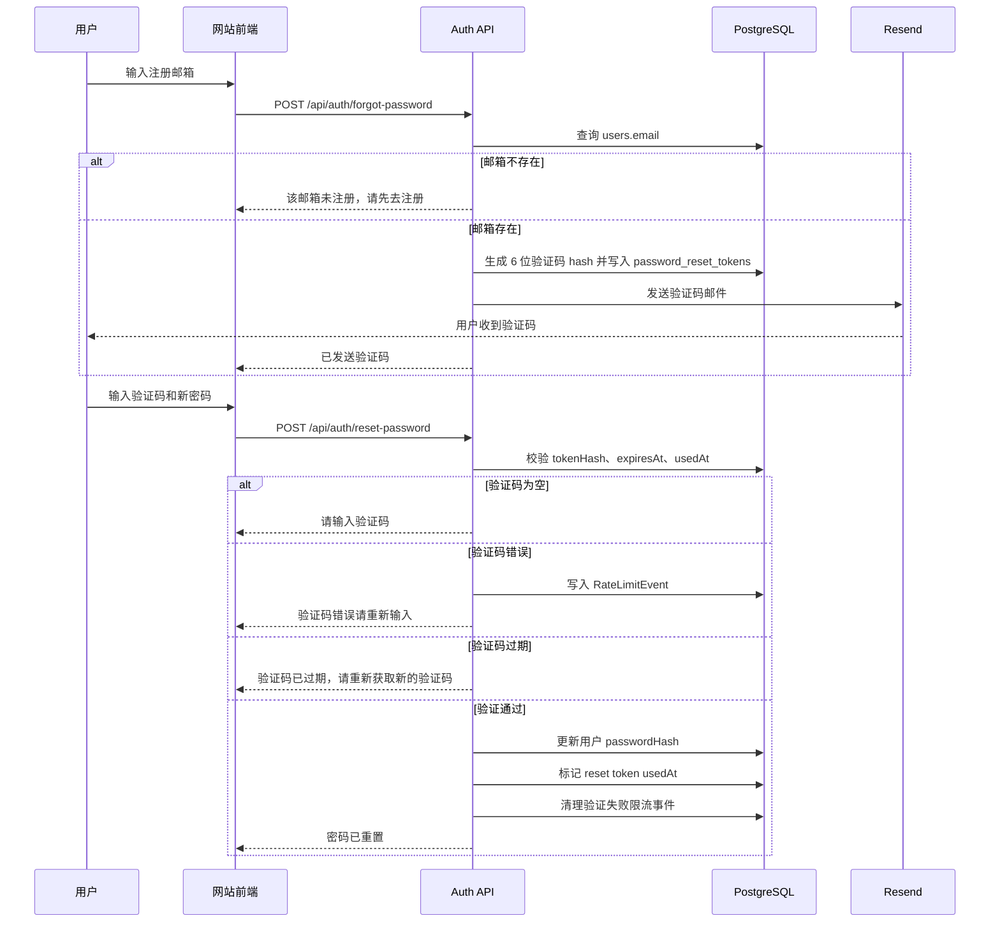

### 5.5 验证码安全设计

当前验证码策略：

- 6 位数字。
- 有效期 15 分钟。
- 数据库存储 hash，不保存明文验证码。
- 验证成功后标记 `usedAt`，防止重复使用。
- 发送验证码限流：
  - 同邮箱 60 秒最多 1 次。
  - 同 IP 10 分钟最多 10 次。
- 验证验证码限流：
  - 同邮箱 10 分钟内错误最多 5 次。
  - 同 IP 10 分钟内错误最多 10 次。

---

## 第六章 飞书系统

### 6.1 飞书系统定位

飞书系统用于收集联系定制需求。用户在 `/contact` 页面填写需求后，后端会把数据写入飞书多维表格，同时写入本地 `contact_submissions` 表，形成双写入。

相关文件：

- `components/ContactPageClient.tsx`
- `app/api/contact/route.ts`
- `prisma/schema.prisma`
- `prisma/migrations/20260606001000_add_contact_submissions/migration.sql`

### 6.2 飞书环境变量

```text
FEISHU_APP_ID
FEISHU_APP_SECRET
FEISHU_BASE_APP_TOKEN
FEISHU_TABLE_ID
```

说明：

- `FEISHU_APP_SECRET` 必须只通过环境变量读取。
- `FEISHU_BASE_APP_TOKEN` 是多维表格 app token，不是 table_id。
- `FEISHU_TABLE_ID` 可选。如果未配置，后端会调用飞书列出数据表 API，自动使用第一张表。
- 如果 `FEISHU_TABLE_ID` 看起来不像 `tbl...` 格式，后端会忽略该值并回退到自动列出数据表。

### 6.3 联系表单字段

当前表单保留字段包括：

- 姓名
- 公司 / 团队名称
- 手机号
- 微信号
- 邮箱
- 抖音号
- 所属行业
- 预算范围
- 需求描述

后端校验必填项：

- 姓名
- 手机号、邮箱、微信号至少一个
- 所属行业
- 预算范围
- 需求描述

### 6.4 飞书同步流程图

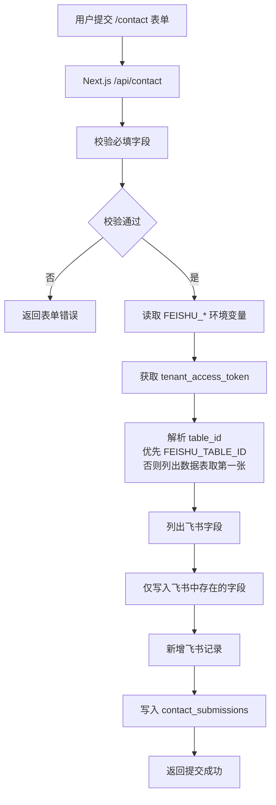

### 6.5 飞书异常处理

当前实现中，如果飞书配置缺失或飞书 API 返回错误，接口会返回失败提示。错误日志会使用 `safeErrorMessage` 过滤 Bearer token，避免输出访问令牌。字段不存在时会记录 warning，但不会因为单个字段缺失而崩溃。

---

## 第七章 AI工具架构

### 7.1 工具列表

当前主工具链路由 `/api/toolbox/office` 承接，工具包括：

| 序号 | 工具 | toolId | 输入类型 |
| --- | --- | --- | --- |
| 1 | Excel 分析 | `excel` | `.xlsx / .xls / .csv` |
| 2 | PDF 总结 | `pdf` | `.pdf / 文档` |
| 3 | 合同重点提取 | `contract` | 文件 / 文本 |
| 4 | 周报月报生成 | `report` | 文本 |
| 5 | PPT 大纲大师 | `ppt` | 文本 |
| 6 | 会议纪要整理 | `meeting` | 文本 |
| 7 | 邮件润色 | `polish` | 文本 |

当前产品描述中也包含电商文案生成。代码里存在旧版独立接口 `/api/ecommerce` 和页面 `app/tools/ecommerce/page.tsx`，但 V2.0 主体额度、套餐和使用记录闭环主要围绕 `/api/toolbox/office` 统一工具入口。

### 7.2 工具调用流程

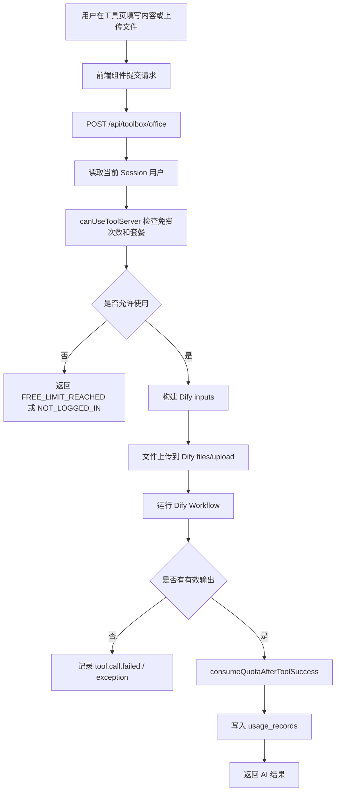

### 7.3 Dify 输入映射

当前后端统一接收：

- `tool_type`
- `text_input`
- `user_requirement`
- `files`
- `report_type`
- `report_style`
- `ppt_topic`
- `ppt_style`
- `ppt_pages`
- `communication_type`
- `communication_tone`

各工具会被转换成 Dify Workflow inputs。Excel、PDF、合同类工具涉及文件上传，会先通过 `uploadFile` 上传到 Dify，再把文件 ID 转成 Dify document 类型输入。

Excel 分析中，用户的“分析目标”已经接入 `text_input`，后端会把用户目标包装进强制输出要求，要求 Dify 最终报告中包含“用户指定问题响应”。这解决了用户提出具体问题但模型只生成常规报告的问题。

### 7.4 Dify 调用层

Dify 调用封装位于：

```text
lib/dify.ts
```

核心能力：

- 获取 Dify base URL。
- 上传文件。
- 转换 Dify document 输入。
- 调用普通 Workflow。
- 调用 streaming Workflow。
- 提取 Dify 输出结果。
- 封装 Dify API 错误。

生产环境中不会输出 API Key 和文件内容。开发环境会输出 Dify input summary，用于确认 `tool_type`、inputs key 列表和用户要求是否传入，但不会输出完整文件内容。

---

## 第八章 数据库设计

### 8.1 数据表列表

当前 Prisma schema 包含以下表：

| Prisma Model | 数据库表 | 用途 |
| --- | --- | --- |
| `User` | `users` | 用户账号、邮箱、密码 hash、角色 |
| `PasswordResetToken` | `password_reset_tokens` | 找回密码验证码 hash、过期时间、使用时间 |
| `UserQuota` | `user_quotas` | 用户额度兼容表，目前免费次数主要由使用记录推导 |
| `UsageRecord` | `usage_records` | 工具调用记录、状态、消耗次数、错误信息 |
| `AuditLog` | `audit_logs` | 审计日志 |
| `RateLimitEvent` | `rate_limit_events` | 登录、注册、验证码、工具失败等限流事件 |
| `ContactSubmission` | `contact_submissions` | 联系定制表单本地落库 |
| `Subscription` | `subscriptions` | 套餐、状态、剩余 credits、到期时间 |
| `Order` | `orders` | 订单记录、支付状态、金额、套餐额度 |

### 8.2 用户表 users

主要字段：

- `id`
- `email`
- `password_hash`
- `role`
- `created_at`
- `updated_at`

用途：

- 保存用户基础身份。
- 用 `role` 区分普通用户和管理员。
- 通过 `password_hash` 保存 bcrypt 后的密码。

### 8.3 密码重置表 password_reset_tokens

主要字段：

- `id`
- `user_id`
- `token_hash`
- `expires_at`
- `used_at`
- `created_at`

用途：

- 保存验证码 hash。
- 控制 15 分钟有效期。
- 使用后通过 `used_at` 标记失效。
- 支持验证码不可重复使用。

### 8.4 使用记录表 usage_records

主要字段：

- `id`
- `user_id`
- `tool_id`
- `tool_name`
- `input_type`
- `status`
- `quota_used`
- `error_message`
- `created_at`

用途：

- Dashboard 使用记录。
- 免费次数统计。
- 套餐额度消耗记录。
- 管理后台用户使用详情。
- CSV 导出。

### 8.5 套餐和订单表

`subscriptions` 用于保存用户当前有效套餐：

- `plan`
- `status`
- `credits`
- `expires_at`

`orders` 用于保存订单：

- `plan_name`
- `amount`
- `quota_amount`
- `payment_provider`
- `payment_status`
- `payment_trade_no`
- `paid_at`

当前真实支付未接入，`/api/payment/create-order` 会创建 pending 订单，`/api/payment/webhook` 仍是支付回调骨架。管理员可通过 `/api/admin/subscriptions/grant` 手动开通套餐。

### 8.6 ER 图

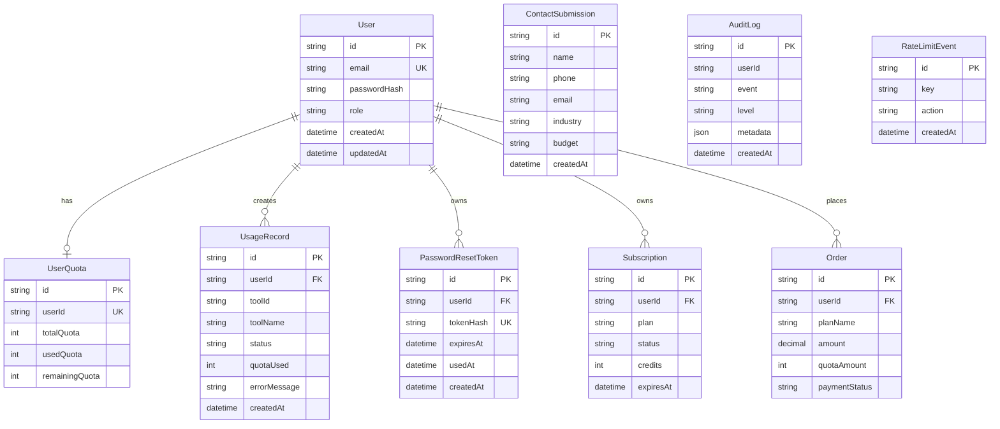

### 8.7 Migration

当前 migration 目录包括：

- `20260605000000_init_postgres`
- `20260605001000_add_audit_logs`
- `20260605002000_add_rate_limit_events`
- `20260606001000_add_contact_submissions`
- `20260606010000_add_subscriptions`
- `20260606011000_add_user_role`

生产部署时需要执行：

```bash
npx prisma migrate deploy
```

---

## 第九章 Dashboard

### 9.1 Dashboard 定位

Dashboard 是普通用户登录后的个人中心。它展示用户账号、套餐、额度、免费次数、使用趋势、工具分类统计和使用记录。

主要文件：

- `app/dashboard/page.tsx`
- `components/DashboardClient.tsx`
- `app/api/dashboard/summary/route.ts`
- `app/api/usage-records/route.ts`
- `app/api/usage-records/export/route.ts`
- `app/api/quota/me/route.ts`

### 9.2 当前实现

Dashboard 当前实现：

- 当前用户邮箱。
- 当前套餐名称。
- 总额度。
- 剩余额度。
- 最近一次使用工具。
- 7 天 / 30 天 / 90 天 / 全部的趋势统计。
- 总调用次数。
- 成功次数。
- 失败次数。
- 按工具分类统计。
- 使用记录分页。
- 工具筛选。
- 时间范围筛选。
- CSV 导出。
- 每个工具免费次数。

### 9.3 数据来源

Dashboard 不再依赖 localStorage。数据来源为服务端 API：

```text
GET /api/dashboard/summary
GET /api/usage-records
GET /api/usage-records/export
GET /api/quota/me
```

核心数据来自：

- `users`
- `usage_records`
- `subscriptions`
- `user_quotas`

### 9.4 Dashboard 数据流

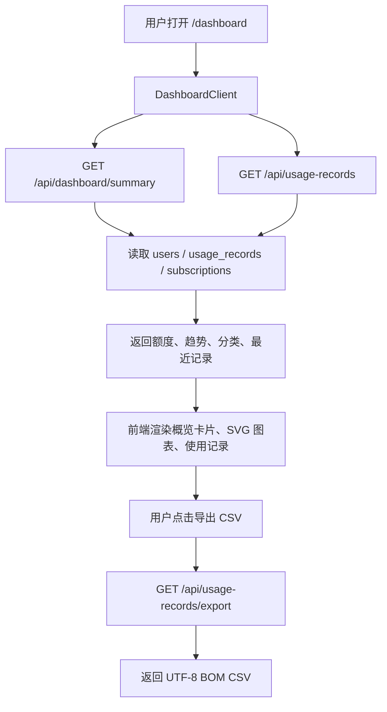

---

## 第十章 Admin后台

### 10.1 Admin 定位

Admin 后台用于站点管理员管理用户、联系表单、使用记录、订单和套餐，是 V2.0 变现闭环的运营入口。

主要文件：

- `app/admin/page.tsx`
- `components/AdminPageClient.tsx`
- `app/api/admin/summary/route.ts`
- `app/api/admin/export/route.ts`
- `app/api/admin/subscriptions/grant/route.ts`
- `app/api/admin/users/[userId]/usage/route.ts`

### 10.2 当前功能

Admin 后台当前功能：

- 用户管理。
- 最近 7 个用户默认展示，支持查看更多。
- 用户邮箱旁可查看该用户详细使用记录。
- 单个用户使用记录分页查看。
- 单个用户免费次数查看。
- 单个用户套餐状态查看。
- 联系表单最近 7 条默认展示，支持展开历史。
- CSV 导出用户、联系表单、使用记录和订单。
- 手动为用户开通套餐。
- 查看订单和套餐数据。

### 10.3 管理员权限控制

管理员接口都会：

1. 通过 session cookie 获取当前用户。
2. 查询 `users` 表。
3. 校验 `role === "admin"`。
4. 未登录返回 401。
5. 非管理员返回 403。

这意味着仅前端隐藏入口是不够的，真正权限控制在服务端接口完成。

### 10.4 Admin 数据流

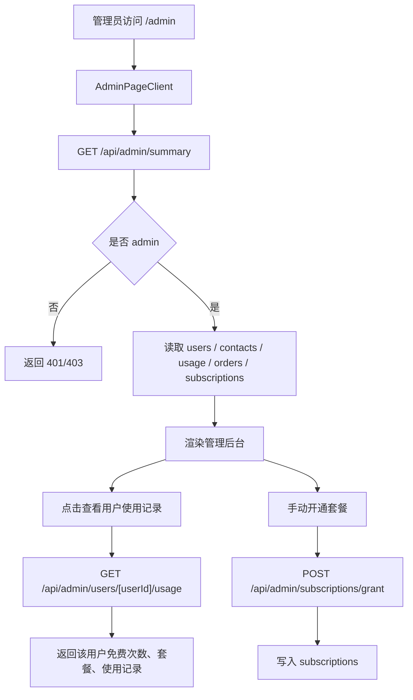

---

## 第十一章 安全体系

### 11.1 密码安全

密码不明文保存。注册和重置密码时，服务端调用：

```text
bcrypt.hash(password, 12)
```

登录时使用 bcrypt compare 校验。

### 11.2 Session 安全

Session 使用 httpOnly signed cookie：

- Cookie 名称：`office_ai_session`
- 签名算法：HMAC SHA-256
- Secret：`AUTH_SESSION_SECRET`
- 生产环境缺少 `AUTH_SESSION_SECRET` 会直接抛出错误。
- 本地开发环境才允许 fallback。

### 11.3 验证码安全

验证码不明文入库。hash 方式为：

```text
sha256(email:code)
```

验证成功后将该用户所有未使用 reset token 标记 usedAt，防止旧验证码继续可用。

### 11.4 限流设计

限流事件写入：

```text
rate_limit_events
```

登录失败：

- 同邮箱 10 分钟内失败 5 次。
- 同 IP 10 分钟内失败 5 次。

注册：

- 同邮箱 10 分钟最多 3 次。
- 同 IP 10 分钟最多 5 次。

忘记密码申请：

- 同邮箱 60 秒内最多 1 次。
- 同 IP 10 分钟最多 10 次。

重置密码验证码错误：

- 同邮箱 10 分钟内错误最多 5 次。
- 同 IP 10 分钟内错误最多 10 次。

工具调用失败：

- 记录 `tool.call.failed`。
- 连续失败达到阈值时写入 `tool.call.repeated_failed`。

### 11.5 AuditLog

审计日志写入：

```text
audit_logs
```

记录事件包括：

- 注册成功。
- 注册限流。
- 登录成功。
- 登录失败。
- 登录限流。
- 退出登录。
- 忘记密码申请。
- 忘记密码限流。
- 邮件发送失败。
- reset token 无效或过期。
- 重置密码成功。
- 额度不足。
- 工具调用失败。
- 工具调用异常。
- 工具连续失败。
- CSV 导出成功。
- CSV 导出失败。
- Dashboard 数据读取失败。

日志要求：

- 不记录密码。
- 不记录 reset token。
- 不记录 API Key。
- 不记录完整文件内容。
- metadata 仅记录必要字段，例如 `tool_type`、`errorType`、`emailHash`、`ipHash`。
- 写日志失败不应影响主流程。

### 11.6 HTTP 安全头

`next.config.mjs` 已配置：

- `Strict-Transport-Security`
- `X-Content-Type-Options`
- `X-Frame-Options`
- `Referrer-Policy`
- `Permissions-Policy`

### 11.7 安全架构图

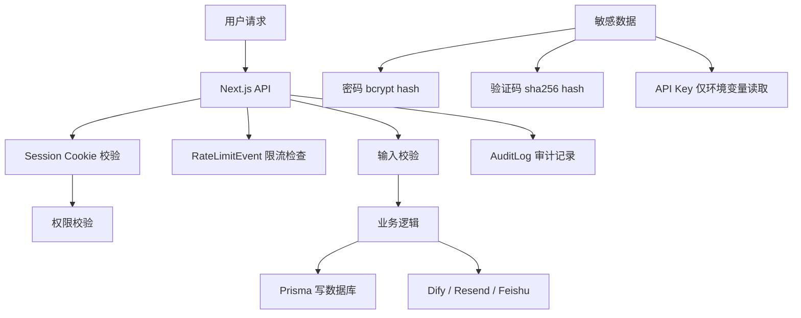

---

## 第十二章 变现系统

### 12.1 商业逻辑

V2.0 的变现目标是形成：

```text
免费体验 -> 额度消耗 -> 套餐购买 -> 后台开通 -> 继续使用
```

当前已实现：

- 每个工具免费 1 次。
- 免费次数由 `usage_records` 中当前用户、当前工具的成功调用次数推导。
- 超出免费次数时返回 `FREE_LIMIT_REACHED`。
- 套餐数据模型已实现。
- 订单数据模型已实现。
- 管理员可手动开通套餐。
- Dashboard 显示免费次数、套餐状态、剩余额度。

当前未实现：

- 微信支付真实回调。
- 支付宝真实回调。
- 自动验签。
- 支付成功后自动开通套餐。

### 12.2 套餐定义

套餐定义位于：

```text
lib/plans.ts
```

当前套餐：

| 套餐 | 价格 | 获得 |
| --- | --- | --- |
| 基础版 | 9.9 元 | 20 次工具调用 |
| 标准版 | 29.9 元 | 100 次工具调用 |
| 高级版 | 99 元 | 30 天无限调用 |

高级版在数据库中通过 `credits = -1` 或套餐定义 `unlimited = true` 表示无限调用，并设置有效期。

### 12.3 工具使用权限判断

工具调用前：

1. 查询当前用户。
2. 查询当前工具免费使用次数。
3. 如果当前工具还有免费次数，允许调用。
4. 如果免费次数用完，查询有效订阅。
5. 如果订阅存在且有 credits 或无限调用，允许调用。
6. 如果没有可用免费次数和订阅，返回 `FREE_LIMIT_REACHED`。

调用成功后：

- 如果来自免费次数，只写入 `usage_records`。
- 如果来自订阅且不是无限套餐，订阅 credits 减 1。
- 写入 `usage_records` 成功记录。

### 12.4 商业闭环图

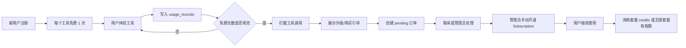

---

## 第十三章 项目开发历程

### 13.1 从 Dify 工作流到独立网站

项目最初的核心能力来自 Dify Workflow。Dify 提供工具编排、模型节点、文件处理和结果生成。独立网站的第一阶段工作，是把这些工作流包装成可访问的工具页面，使用户可以通过浏览器上传文件、填写需求并获得结果。

### 13.2 从演示版用户系统到 Prisma + Postgres

早期用户系统曾出现“重新部署后账号丢失”的问题，根因是用户数据没有完整持久化。后续迁移到 Prisma + PostgreSQL + Neon，用户、密码 hash、额度、使用记录、密码重置 token 等都进入数据库。

### 13.3 联系表单接入飞书

联系定制页面从纯前端提示升级为真实提交链路：

```text
网站表单 -> /api/contact -> 飞书多维表格 -> contact_submissions
```

这样既方便用户提交需求，也方便运营侧在飞书里跟进。

### 13.4 邮件找回密码

项目接入 Resend 后，忘记密码功能从占位变成生产可用流程。用户输入注册邮箱后收到 6 位验证码，验证码通过后可设置新密码。

### 13.5 Dashboard 和使用记录

Dashboard 从 localStorage 演示数据升级为真实数据库数据：

- 额度来自服务端。
- 使用记录来自 `usage_records`。
- 趋势图由服务端聚合。
- CSV 由后端导出。

### 13.6 安全增强

项目增加了：

- 登录限流。
- 注册限流。
- 忘记密码发送限流。
- 验证码错误限流。
- 工具失败日志。
- AuditLog。
- RateLimitEvent。
- 生产环境 session secret 强校验。

### 13.7 V2.0 变现闭环

项目新增：

- 每工具免费 1 次。
- 套餐模型。
- 订单模型。
- 管理员后台。
- 管理员手动开通套餐。
- Admin CSV 导出。

这使项目具备从免费体验到人工收款/开通的最小可行商业闭环。

---

## 第十四章 验收报告

### 14.1 PASS

| 模块 | 状态 | 说明 |
| --- | --- | --- |
| 正式域名 | PASS | `https://aiworkbox.cn` 已上线 |
| Vercel 部署 | PASS | Production 可运行 |
| 用户注册 | PASS | 用户写入 `users` |
| 用户登录 | PASS | httpOnly cookie session |
| 退出登录 | PASS | 清除 session cookie |
| 忘记密码 | PASS | Resend 验证码可发送 |
| 重置密码 | PASS | 验证码正确后可修改密码 |
| Resend 邮件 | PASS | 域名已验证，实际收件通过 |
| 飞书表单 | PASS | `/api/contact` 可写入飞书 |
| 联系表单本地落库 | PASS | 写入 `contact_submissions` |
| Dashboard | PASS | 真实数据库数据 |
| 使用记录分页 | PASS | `/api/usage-records` |
| CSV 导出 | PASS | UTF-8 BOM CSV |
| Admin 后台 | PASS | 管理员角色控制 |
| Admin 用户详情 | PASS | 独立用户使用记录接口 |
| 免费次数 | PASS | 每工具 1 次免费 |
| 套餐系统 | PASS | `subscriptions` 模型和手动开通 |
| 订单模型 | PASS | `orders` 表和 pending 订单 |
| 登录限流 | PASS | 邮箱/IP 维度 |
| 注册限流 | PASS | 邮箱/IP 维度 |
| 忘记密码发送限流 | PASS | 邮箱/IP 维度 |
| 验证码错误限流 | PASS | 邮箱/IP 维度 |
| AuditLog | PASS | 多类事件已记录 |
| RateLimitEvent | PASS | 限流事件已落库 |
| HTTP 安全头 | PASS | next.config.mjs 已配置 |
| Prisma migration | PASS | 已有 migration 文件 |

### 14.2 FAIL

当前文档生成时，没有发现必须标记为已知失败的核心生产功能。需要注意的是，部分历史源文件中中文字符串在命令行读取时显示为乱码，这属于编码显示或文件内容编码风险，应在后续代码整理中检查和修复，但不等同于当前线上功能必然失败。

### 14.3 TODO

| 项目 | 优先级 | 说明 |
| --- | --- | --- |
| 微信支付 | V2.1 | 接入真实支付创建、回调验签、订单幂等 |
| 支付宝支付 | V2.1 | 接入真实支付创建、回调验签、订单幂等 |
| 支付自动开通套餐 | V2.1 | 支付成功后自动写入 `subscriptions` |
| 过期验证码清理任务 | P2 | 定期清理 `password_reset_tokens` 中过期或已使用数据 |
| 旧工具独立 API 清理 | P2 | `/api/pdf`、`/api/ppt`、`/api/report` 等旧接口可后续标记或下线 |
| 统一中文编码检查 | P2 | 检查源码中中文字符串是否存在 mojibake |
| 管理员告警通知 | P2 | 工具连续失败、邮件失败、支付失败可通知管理员 |
| 自动化测试 | P2 | 补充 API 单测和端到端测试 |

---

## 第十五章 后续规划

### 15.1 V2.1：自动支付

V2.1 建议优先打通自动支付闭环：

- 微信支付。
- 支付宝支付。
- 支付订单创建。
- 支付回调验签。
- 防重放和幂等处理。
- 支付成功后自动开通套餐。
- 支付失败和异常订单告警。
- Dashboard 显示订单状态。
- Admin 支付记录筛选和导出。

推荐支付架构：

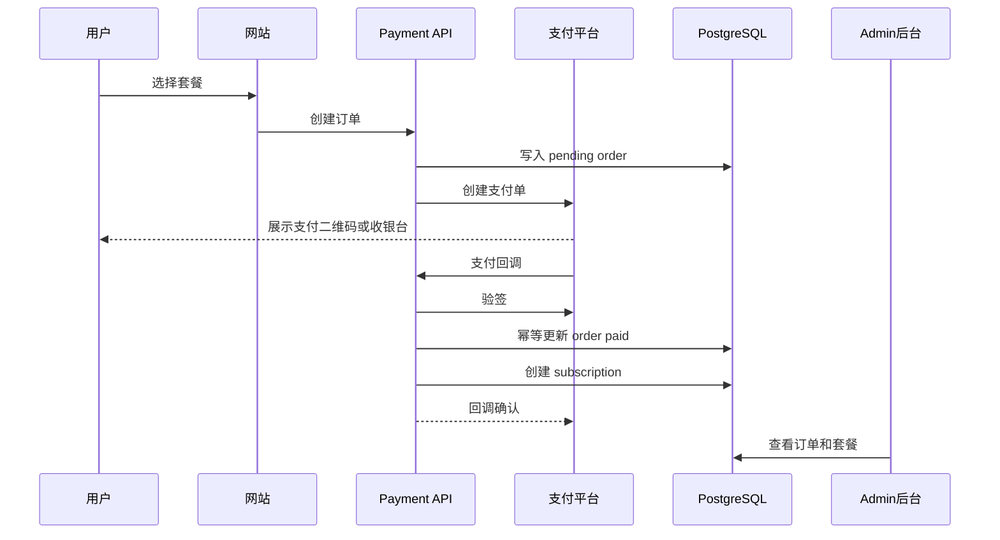

### 15.2 V3.0：工具矩阵扩展

V3.0 可以扩展更多工具箱：

- OCR 识别。
- 发票识别。
- 简历优化。
- 招聘 JD 生成。
- 客服话术生成。
- 外贸邮件助手。
- 电商运营助手增强版。
- 自媒体内容助手增强版。

### 15.3 企业版

企业版可支持：

- 企业账号。
- 团队成员管理。
- 团队额度池。
- 企业级审计日志。
- 私有知识库。
- 私有 Dify Workflow。
- 定制工具入口。
- 企业合同和发票流程。

### 15.4 项目路线图

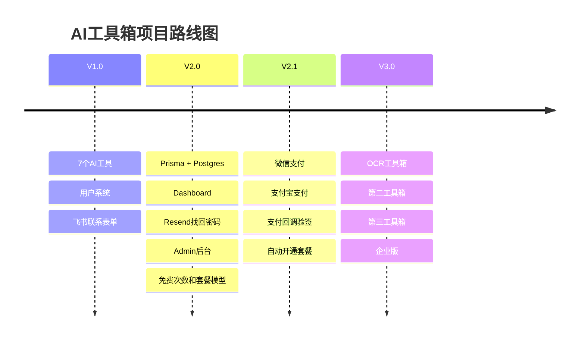

---

## 附录 A：关键环境变量

以下仅列变量名，不列值。

### 数据库

```text
DATABASE_URL
```

### 认证

```text
AUTH_SESSION_SECRET
```

### Dify

```text
DIFY_BASE_URL
TOOLBOX_OFFICE_API_KEY
```

### Resend

```text
EMAIL_PROVIDER
EMAIL_FROM
RESEND_API_KEY
NEXT_PUBLIC_APP_URL
```

### 飞书

```text
FEISHU_APP_ID
FEISHU_APP_SECRET
FEISHU_BASE_APP_TOKEN
FEISHU_TABLE_ID
```

---

## 附录 B：关键 API 清单

| API | 方法 | 用途 |
| --- | --- | --- |
| `/api/auth/register` | POST | 用户注册 |
| `/api/auth/login` | POST | 用户登录 |
| `/api/auth/logout` | POST | 用户退出 |
| `/api/auth/me` | GET | 当前用户 |
| `/api/auth/forgot-password` | POST | 发送找回密码验证码 |
| `/api/auth/reset-password` | POST | 重置密码 |
| `/api/toolbox/office` | POST | 统一 AI 工具调用 |
| `/api/contact` | POST | 联系定制表单，写飞书和数据库 |
| `/api/dashboard/summary` | GET | Dashboard 概览 |
| `/api/usage-records` | GET | 使用记录分页和筛选 |
| `/api/usage-records/export` | GET | 当前用户使用记录 CSV |
| `/api/quota/me` | GET | 当前用户额度和免费次数 |
| `/api/admin/summary` | GET | 管理员后台汇总 |
| `/api/admin/export` | GET | 管理员 CSV 导出 |
| `/api/admin/subscriptions/grant` | POST | 管理员手动开通套餐 |
| `/api/admin/users/[userId]/usage` | GET | 管理员查看单个用户使用记录 |
| `/api/payment/create-order` | POST | 创建 pending 订单 |
| `/api/payment/webhook` | POST | 支付回调骨架 |

---

## 附录 C：当前生产部署注意事项

1. Vercel Production 必须配置 `DATABASE_URL`。
2. Vercel Production 必须配置 `AUTH_SESSION_SECRET`。
3. Resend 域名必须在 Resend 控制台完成 Verify Domain。
4. 飞书应用必须有多维表格相关权限。
5. 飞书表格字段名应与后端映射一致，字段缺失会 warning，但不会泄露密钥。
6. Prisma migration 上线时执行 `npx prisma migrate deploy`。
7. Preview 环境如果需要连接 Preview Neon 分支，必须把 Preview 的 `DATABASE_URL` 设置为 Preview 连接串。
8. 不要提交 `.env`、`.env.local`、API Key、数据库连接串或任何 token。

---

## 结语

AI工具箱 V2.0 已经从单纯的 AI 工具集合，升级为具备账号体系、数据持久化、邮件找回密码、安全限流、审计日志、Dashboard、Admin 后台、免费次数和套餐模型的可运营产品。当前最重要的下一步，是把支付从“订单骨架 + 管理员手动开通”升级为“真实支付 + 回调验签 + 自动开通套餐”，从而完成完全自动化的商业闭环。
