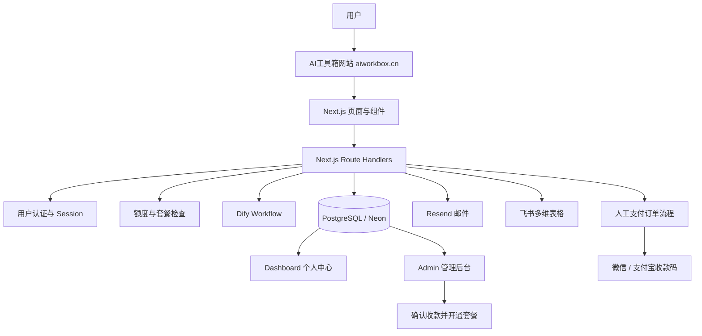
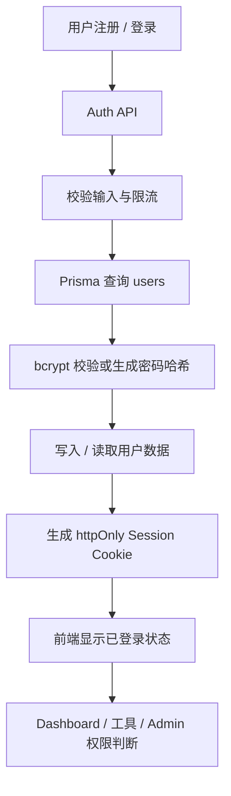
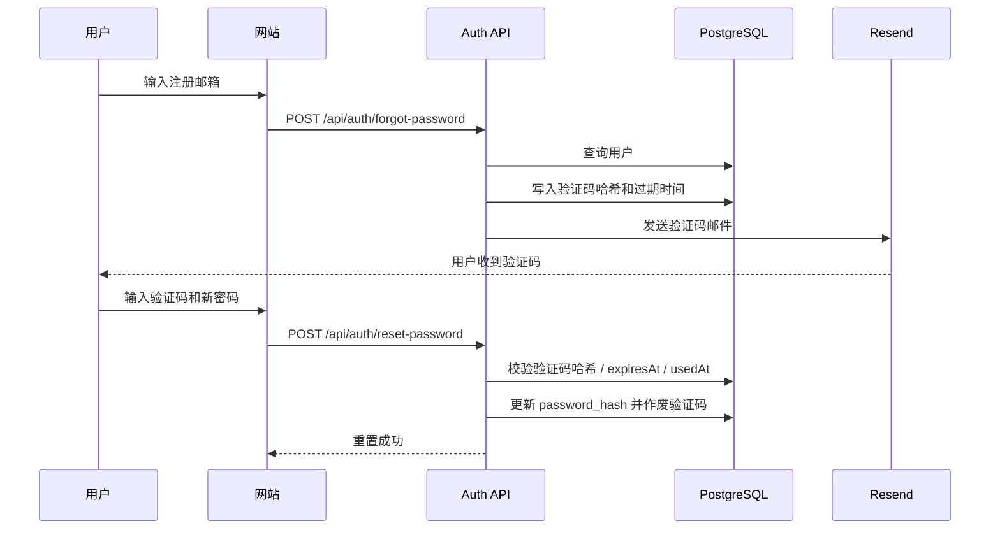
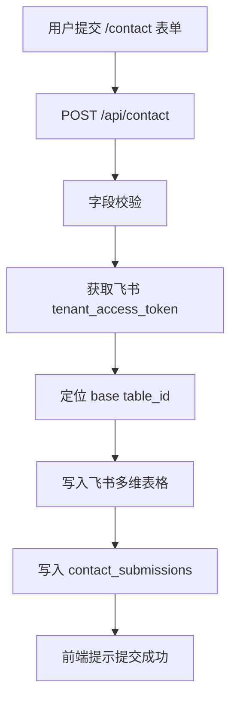
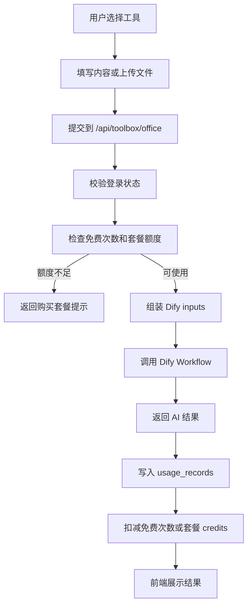
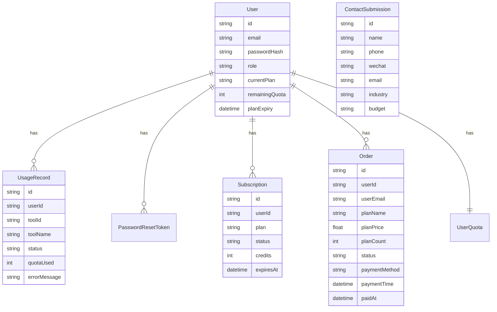
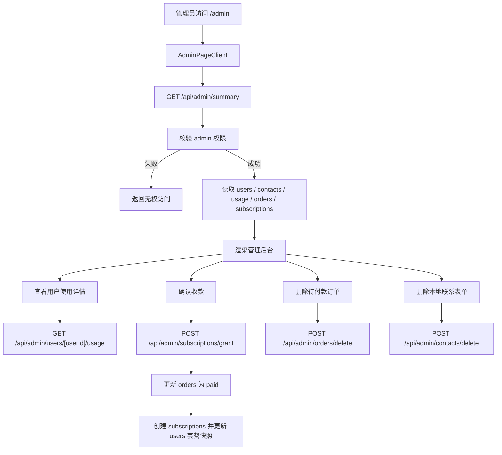
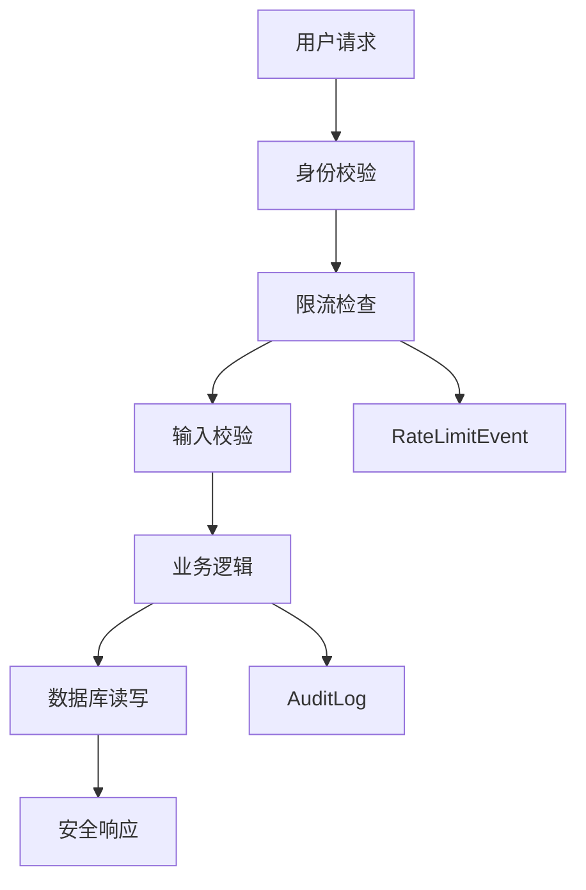
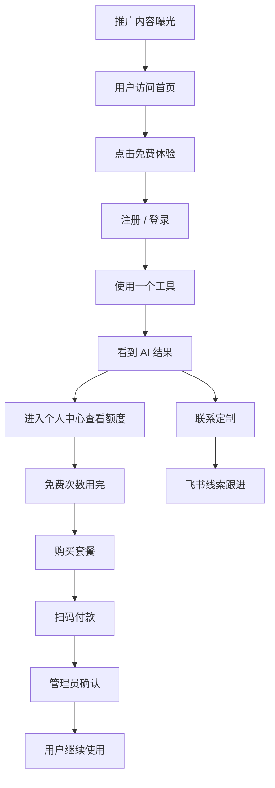
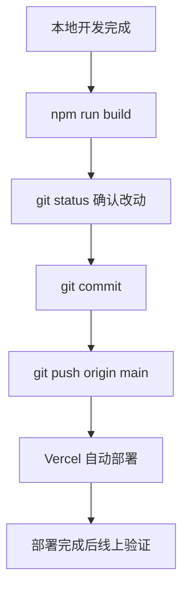

# AI工具箱 V2.0 完整技术文档

> 文档版本：V2.0 / V2.1 更新版
> 最后更新：2026-06-07
> 项目定位：面向办公场景的 AI 效率工具平台
> 正式域名：https://aiworkbox.cn
> 当前阶段：产品功能闭环已完成，准备进入推广阶段
> 安全说明：本文档不包含任何 API Key、Token、数据库连接串、邮箱密钥或密码。

---

## 第一章 项目概述

AI工具箱是一个面向办公场景的 AI 效率工具平台。项目的目标不是简单展示 AI 能力，而是把常见办公任务产品化，让普通用户通过网页表单、文件上传和按钮操作，就能完成 Excel 分析、PDF 总结、合同提取、报告生成、PPT 大纲、会议纪要、邮件润色、电商文案等任务。

项目当前线上域名：

```text
https://aiworkbox.cn
```

从产品形态看，AI工具箱已经从“AI 工具集合”升级为“轻量 SaaS 产品”。它具备用户系统、数据库持久化、邮件找回密码、联系定制表单、飞书同步、Dashboard、Admin 后台、免费体验、套餐额度、人工扫码支付、管理员确认收款、CSV 导出和安全限流等能力。

### 1.1 项目为什么做

办公场景里有大量重复、耗时但规则相对清晰的任务，例如：

- 查看 Excel 表格并输出分析结论。
- 阅读 PDF 并总结重点。
- 从合同中提取主体、金额、期限、违约责任和风险点。
- 根据工作内容生成日报、周报或月报。
- 根据主题生成 PPT 大纲。
- 整理会议纪要和待办事项。
- 润色邮件、通知、公文或沟通内容。
- 根据商品和卖点生成电商文案。

这些任务适合由大模型处理，但普通用户直接使用大模型时会遇到提示词、文件处理、格式要求、结果保存和额度统计等问题。AI工具箱的价值是把这些复杂性隐藏在产品背后，让用户只面对清晰的工具入口和表单。

### 1.2 版本演进

#### V1.0

V1.0 解决“能不能用”的问题：

- 7 个 AI 办公工具。
- 用户注册登录。
- 免费体验额度。
- 联系定制页面。
- 飞书多维表格同步。
- Dify Workflow 调用链路。

#### V2.0

V2.0 解决“能不能运营”的问题：

- 用户数据迁移到 PostgreSQL + Prisma。
- 登录状态使用 httpOnly cookie。
- 密码使用哈希存储。
- 忘记密码使用 Resend 邮件验证码。
- Dashboard 读取真实额度和使用记录。
- UsageRecord 持久化。
- CSV 导出。
- Admin 管理员后台。
- AuditLog 审计日志。
- RateLimitEvent 限流事件。
- 注册、登录、忘记密码、验证码验证限流。
- 免费次数和套餐模型。

#### V2.1

V2.1 解决“能不能收款”的问题：

- 套餐价格更新为 9.9 元 / 20 次、19.9 元 / 50 次、49.9 元 / 150 次。
- 用户在套餐页创建 pending 订单。
- 新增订单支付页 `/payment/[orderId]`。
- 支付页展示微信 / 支付宝固定收款码。
- 用户先选择付款方式，再显示对应二维码。
- 用户点击“我已付款”后，系统记录服务器提交时间为付款时间。
- 用户可上传付款截图，截图与订单绑定。
- 订单状态从 `pending` 到 `claimed_paid`，等待管理员确认。
- Admin 后台确认收款后，订单变为 `paid` 并自动给用户开通套餐。
- Admin 后台支持批量删除过期未付款订单。
- Admin 后台支持删除本地联系表单记录，但不影响飞书多维表格。

---

## 第二章 技术栈

### 2.1 前端

| 技术 | 用途 |
| --- | --- |
| Next.js 16.2.6 | App Router、页面路由、Route Handlers、生产构建 |
| React 18.3.1 | 组件和交互状态 |
| TypeScript 5.6.3 | 类型约束 |
| Tailwind CSS 3.4.15 | 页面样式和响应式布局 |
| lucide-react | 图标 |
| react-markdown | AI 输出渲染 |
| remark-gfm / rehype-highlight | Markdown 扩展和代码高亮 |

主要前端组件：

- `components/SiteHeader.tsx`
- `components/AuthPageClient.tsx`
- `components/ForgotPasswordPageClient.tsx`
- `components/ResetPasswordPageClient.tsx`
- `components/GenericToolPageClient.tsx`
- `components/OfficeToolboxClient.tsx`
- `components/DashboardClient.tsx`
- `components/AdminPageClient.tsx`
- `components/ContactPageClient.tsx`
- `components/PricingPageClient.tsx`
- `components/PaymentOrderPageClient.tsx`

### 2.2 后端

后端使用 Next.js Route Handlers，接口位于：

```text
app/api/*
```

核心接口包括：

- `/api/auth/register`
- `/api/auth/login`
- `/api/auth/logout`
- `/api/auth/me`
- `/api/auth/forgot-password`
- `/api/auth/reset-password`
- `/api/toolbox/office`
- `/api/contact`
- `/api/dashboard/summary`
- `/api/usage-records`
- `/api/usage-records/export`
- `/api/admin/summary`
- `/api/admin/export`
- `/api/admin/users/[userId]/usage`
- `/api/admin/subscriptions/grant`
- `/api/admin/orders/delete`
- `/api/admin/contacts/delete`
- `/api/payment/create-order`
- `/api/payment/order`
- `/api/payment/orders`
- `/api/payment/claim-order`
- `/api/payment/webhook`

### 2.3 数据库

| 技术 | 用途 |
| --- | --- |
| PostgreSQL | 生产数据库 |
| Neon | PostgreSQL 托管服务 |
| Prisma 5.22.0 | ORM、schema、migration |
| @prisma/client | 服务端数据库读写 |

Prisma 数据源：

```prisma
datasource db {
  provider = "postgresql"
  url      = env("DATABASE_URL")
}
```

注意：Prisma 只读取 `DATABASE_URL`。如果 Vercel Preview 需要连接 Neon Preview 数据库，必须在 Vercel Preview 环境里配置同名 `DATABASE_URL` 指向 Preview 分支。`DATABASE_URL_PREVIEW` 可以保留作人工参考，但 Prisma 不会自动读取它。

### 2.4 AI 能力

| 技术 | 用途 |
| --- | --- |
| Dify Workflow | 承接 7 个工具的工作流编排 |
| DeepSeek API | 模型能力由 Dify 工作流内部配置 |

项目代码侧通过：

- `lib/dify.ts`
- `app/api/toolbox/office/route.ts`

调用 Dify。当前采用统一 Dify Key：

- `DIFY_BASE_URL`
- `TOOLBOX_OFFICE_API_KEY`

### 2.5 邮件系统

邮件系统使用 Resend，主要用于忘记密码验证码发送。

生产环境变量：

- `EMAIL_PROVIDER`
- `EMAIL_FROM`
- `RESEND_API_KEY`
- `NEXT_PUBLIC_APP_URL`

当前 Resend 域名已验证，邮件验证码可真实发送到用户邮箱。

### 2.6 飞书系统

联系定制表单会写入飞书多维表格，同时保存到 Neon 本地数据库。

相关环境变量：

- `FEISHU_APP_ID`
- `FEISHU_APP_SECRET`
- `FEISHU_BASE_APP_TOKEN`
- `FEISHU_TABLE_ID`，可选

如果 `FEISHU_TABLE_ID` 为空，后端会通过飞书“列出数据表”API 获取第一张表的 `table_id`。

### 2.7 部署

| 服务 | 当前用途 |
| --- | --- |
| Vercel | Next.js 生产部署 |
| aiworkbox.cn | 正式域名 |
| Neon | 生产数据库 |
| Resend | 生产邮件 |
| 飞书开放平台 | 联系表单写入 |
| GitHub | 源代码托管与 Vercel 自动部署 |

---

## 第三章 系统架构图



整体数据流：

1. 用户在网站选择工具或套餐。
2. 前端调用 Next.js API。
3. API 校验登录状态、额度、权限和输入。
4. 工具调用进入 Dify Workflow。
5. 成功调用后写入 `usage_records` 并扣减额度。
6. 联系表单写入飞书和本地数据库。
7. 套餐购买创建订单，管理员确认收款后写入订阅。
8. Dashboard 和 Admin 从数据库读取真实数据。

---

## 第四章 用户系统架构

用户系统已从 localStorage 演示版迁移为服务端持久化方案。

### 4.1 注册

注册接口：

```text
POST /api/auth/register
```

流程：

1. 校验邮箱和密码。
2. 注册限流检查。
3. 查询邮箱是否已存在。
4. 使用 bcrypt 哈希密码。
5. 写入 `users` 表。
6. 初始化用户基础数据。
7. 写入 AuditLog。

### 4.2 登录

登录接口：

```text
POST /api/auth/login
```

登录成功后写入 httpOnly cookie。用户登录后默认返回首页或保持当前体验路径，不强制进入 Dashboard。

### 4.3 Session

Session 使用服务端签名 cookie。生产环境必须配置：

```text
AUTH_SESSION_SECRET
```

生产环境缺少该变量会直接抛出配置错误。本地开发允许 fallback，便于调试。

### 4.4 角色权限

用户角色字段：

```text
users.role
```

当前角色：

- `user`
- `admin`

Admin 页面和 Admin API 都会校验当前用户是否为 `admin`。

### 4.5 用户系统流程图



---

## 第五章 邮件系统

邮件系统用于忘记密码验证码。

### 5.1 当前流程

1. 用户进入忘记密码页面。
2. 输入注册邮箱。
3. 后端查询邮箱是否存在。
4. 生成 6 位验证码。
5. 将验证码哈希写入 `password_reset_tokens`。
6. 设置有效期 15 分钟。
7. 使用 Resend 发送验证码邮件。
8. 用户输入验证码和新密码。
9. 后端校验验证码哈希、过期时间、使用状态。
10. 修改密码并设置 `usedAt`，验证码失效。
11. 用户使用新密码登录。

### 5.2 邮件流程图



### 5.3 安全策略

- 密码不明文保存。
- 验证码不明文保存，保存哈希。
- 验证码 15 分钟有效。
- 验证成功后立即失效。
- 忘记密码发送有频率限制。
- 验证码错误次数有限流。

---

## 第六章 飞书系统

联系定制页面 `/contact` 是商务线索入口。

### 6.1 表单字段

当前字段包括：

- 姓名
- 公司 / 团队名称
- 手机号
- 微信号
- 邮箱
- 抖音号
- 所属行业
- 预算范围
- 需求描述

### 6.2 写入逻辑

提交接口：

```text
POST /api/contact
```

逻辑：

1. 校验必填字段。
2. 获取飞书 `tenant_access_token`。
3. 根据 `FEISHU_BASE_APP_TOKEN` 和可选 `FEISHU_TABLE_ID` 找到目标表。
4. 写入飞书多维表格。
5. 同步保存到本地 `contact_submissions` 表。
6. 返回用户友好成功提示。

### 6.3 飞书流程图



### 6.4 Admin 删除说明

V2.1 起，Admin 后台可以删除本地联系表单记录。该删除只影响 Neon 数据库中的 `contact_submissions`，不会删除飞书多维表格中的数据。这样既能清理后台视图，也能保留飞书中的线索归档。

---

## 第七章 AI 工具架构

当前产品包含 7 个主要 AI 工具：

1. Excel 数据分析。
2. PDF 智能总结。
3. 合同重点提取。
4. 日报 / 周报 / 月报生成。
5. PPT 大纲大师。
6. 邮件 / 通知润色。
7. 电商文案生成。

核心统一入口：

```text
POST /api/toolbox/office
```

### 7.1 工具调用流程



### 7.2 用户输入传递

工具页面会把用户的额外要求传入 Dify，例如：

- Excel 的分析目标。
- PDF 的总结重点。
- 合同的关注条款。
- 报告的风格要求。
- PPT 的页数、风格和主题。
- 邮件润色的语气要求。

其中 Excel 分析目标已接入 Dify 的 `text_input`，用于让模型响应用户指定问题。

### 7.3 不改动原则

当前 7 个工具已经跑通，后续推广阶段不应随意修改：

- Dify Workflow 字段映射。
- 工具主体调用逻辑。
- 文件上传逻辑。
- 额度扣减时机。

除非出现线上问题，否则工具链路以稳定为先。

---

## 第八章 数据库设计

当前核心表：

| Prisma Model | 数据表 | 用途 |
| --- | --- | --- |
| User | users | 用户账号、角色、当前套餐快照 |
| PasswordResetToken | password_reset_tokens | 找回密码验证码哈希和过期时间 |
| UserQuota | user_quotas | 旧额度兼容表 |
| UsageRecord | usage_records | 工具调用记录 |
| AuditLog | audit_logs | 审计日志 |
| RateLimitEvent | rate_limit_events | 限流事件 |
| ContactSubmission | contact_submissions | 本地联系表单 |
| Subscription | subscriptions | 用户套餐、剩余额度、到期时间 |
| Order | orders | 人工支付订单 |

### 8.1 User

`users` 保存：

- 邮箱。
- 密码哈希。
- 角色。
- 当前套餐快照。
- 剩余额度快照。
- 套餐到期时间。

### 8.2 PasswordResetToken

`password_reset_tokens` 保存：

- 用户 ID。
- 验证码哈希。
- 过期时间。
- 使用时间。

### 8.3 UsageRecord

`usage_records` 保存：

- 用户 ID。
- 工具 ID。
- 工具名称。
- 输入类型。
- 状态。
- 消耗额度。
- 错误信息。
- 创建时间。

### 8.4 ContactSubmission

`contact_submissions` 保存本地联系线索。飞书写入成功后，本地也保留一份，便于 Admin 页面查看和导出。

### 8.5 Subscription

`subscriptions` 保存用户套餐：

- 套餐类型。
- 状态。
- 剩余 credits。
- 到期时间。

当前不设不限次数套餐。

### 8.6 Order

`orders` 是 V2.1 人工支付闭环核心表，保存：

- 用户 ID。
- 用户邮箱。
- 套餐名称。
- 套餐价格。
- 套餐次数。
- 订单状态。
- 付款方式。
- 付款时间。
- 付款截图。
- 创建时间。
- 确认收款时间。

订单状态：

| 状态 | 含义 |
| --- | --- |
| pending | 待付款 |
| claimed_paid | 用户已提交付款，待管理员确认 |
| paid | 管理员已确认收款，套餐已开通 |

### 8.7 ER 图



---

## 第九章 Dashboard

Dashboard 是普通用户的个人中心，页面路径：

```text
/dashboard
```

当前功能：

- 显示当前用户邮箱。
- 显示当前套餐。
- 显示总额度和剩余额度。
- 显示最近一次使用工具。
- 显示调用趋势。
- 显示工具分类统计。
- 显示使用记录。
- 支持分页和筛选。
- 支持 CSV 导出。
- 显示我的订单。
- 未付款订单可进入支付页继续提交付款。

数据来源：

- `/api/dashboard/summary`
- `/api/usage-records`
- `/api/usage-records/export`
- `/api/payment/orders`

Dashboard 不再使用 localStorage 保存正式额度或使用记录。

---

## 第十章 Admin 后台

Admin 后台路径：

```text
/admin
```

入口权限：

- 必须登录。
- `users.role` 必须为 `admin`。

### 10.1 当前功能

Admin 后台当前支持：

- 用户总数、联系表单数、使用记录数、订单数、套餐数统计。
- 用户管理。
- 查看单个用户使用详情。
- 联系表单管理。
- 订单管理。
- 手动开通套餐。
- 确认收款并自动开通套餐。
- 导出用户、联系表单、使用记录和订单 CSV。
- 删除本地联系表单。
- 删除待付款订单。

### 10.2 用户管理

默认显示最近 7 个用户，超过部分可以展开。每个用户旁有“查看使用记录”入口，可以查看：

- 每个工具免费次数。
- 当前套餐。
- 最近使用记录。
- 调用状态和错误信息。

### 10.3 联系表单管理

默认显示最近 7 条联系表单，可展开。支持勾选和全选删除本地记录。删除只影响 Neon 数据库，不影响飞书多维表格。

### 10.4 订单管理

订单支持按状态筛选：

- 待处理。
- 待付款。
- 已提交付款。
- 已确认。
- 全部。

订单显示字段：

- 创建订单时间。
- 付款时间。
- 用户邮箱。
- 套餐。
- 金额。
- 状态。
- 付款方式。
- 付款截图。
- 操作。

只有 `pending` 待付款订单可以批量删除。`claimed_paid` 和 `paid` 订单不能通过批量删除功能删除。

### 10.5 Admin 数据流



---

## 第十一章 安全体系

### 11.1 密码和验证码

- 密码使用 bcrypt 哈希保存。
- 验证码使用哈希保存。
- 不保存明文密码。
- 不保存明文验证码作为长期数据。
- reset token / 验证码有过期时间和使用状态。

### 11.2 Cookie 和 Session

- 登录态使用 httpOnly cookie。
- 生产环境必须配置 `AUTH_SESSION_SECRET`。
- 生产环境缺少该变量会抛出错误。

### 11.3 限流

当前限流覆盖：

- 登录失败。
- 注册。
- 忘记密码验证码发送。
- 重置密码验证码验证。

限流事件写入 `rate_limit_events`。

### 11.4 AuditLog

审计日志覆盖：

- 注册成功。
- 登录成功。
- 登录失败。
- 退出登录。
- 忘记密码申请。
- 邮件发送失败。
- reset token 无效或过期。
- 重置密码成功。
- 额度不足。
- 工具调用失败。
- 注册限流。
- 重置验证码限流。
- CSV 导出成功 / 失败。
- Dashboard 数据读取失败。

日志不会记录密码、token、API Key 或完整文件内容。

### 11.5 安全架构图



---

## 第十二章 变现系统

V2.1 已形成可运行的人工支付闭环。

### 12.1 免费体验

每个工具默认赠送 1 次免费体验。免费次数按用户和工具维度判断。

### 12.2 套餐定义

套餐定义位于：

```text
lib/plans.ts
```

当前套餐：

| 套餐 | 价格 | 次数 | 有效期 |
| --- | --- | --- | --- |
| 体验套餐 | 9.9 元 | 20 次 | 30 天 |
| 标准套餐 | 19.9 元 | 50 次 | 30 天 |
| 高级套餐 | 49.9 元 | 150 次 | 30 天 |

当前不设不限次数套餐。

### 12.3 订单创建

用户在 `/pricing` 点击购买套餐：

```text
POST /api/payment/create-order
```

系统创建 `pending` 订单，并跳转到：

```text
/payment/[orderId]
```

### 12.4 支付页

支付页展示：

- 订单号。
- 用户邮箱。
- 套餐名称。
- 套餐次数。
- 金额。
- 创建订单时间。
- 微信 / 支付宝付款方式选择。
- 对应收款码。
- 可选付款截图上传。

用户点击“我已付款，提交确认”后：

```text
POST /api/payment/claim-order
```

后端会：

- 校验登录用户和订单归属。
- 校验付款方式。
- 校验截图类型和大小。
- 使用服务器当前时间写入 `paymentTime`。
- 将订单状态更新为 `claimed_paid`。

### 12.5 管理员确认收款

管理员在 `/admin` 查看 `claimed_paid` 订单，核对截图和实际收款后点击“确认收款”：

```text
POST /api/admin/subscriptions/grant
```

后端会：

1. 校验管理员权限。
2. 查询订单。
3. 匹配套餐。
4. 创建 `subscriptions` 记录。
5. 更新 `orders.status = paid`。
6. 更新 `orders.paymentStatus = paid`。
7. 写入 `paidAt`。
8. 更新 `users.currentPlan`、`users.remainingQuota`、`users.planExpiry`。

### 12.6 商业闭环图


---

## 第十三章 今日新增功能说明

本次文档更新纳入 2026-06-07 新增功能。

### 13.1 支付页交互优化

原本支付页同时展示微信和支付宝两个收款码，并要求用户填写付款时间。现在改为：

- 用户先选择付款方式。
- 选择微信时只展示微信收款码。
- 选择支付宝时只展示支付宝收款码。
- 用户不再手动填写付款时间。
- 用户点击“我已付款”时，后端自动记录服务器时间。

这样可以减少用户误操作，也避免用户手填付款时间不准确。

### 13.2 Admin 订单删除

新增接口：

```text
POST /api/admin/orders/delete
```

能力：

- 支持勾选订单。
- 支持全选当前列表中的待付款订单。
- 只允许删除 `pending` 状态订单。
- 自动跳过 `claimed_paid` 和 `paid` 订单。

目的：

- 方便管理员清理过期未付款订单。
- 避免误删已经提交付款或已经确认收款的订单。

### 13.3 Admin 联系表单删除

新增接口：

```text
POST /api/admin/contacts/delete
```

能力：

- 支持勾选联系表单。
- 支持全选。
- 删除 Neon 本地 `contact_submissions` 记录。
- 不删除飞书多维表格数据。

目的：

- 后台可以清理无效线索。
- 飞书仍作为线索归档中心保留完整数据。

### 13.4 文案更新

网站中用户可见的“返回 Dashboard”已改为：

```text
返回个人中心
```

Pricing 页中“Dashboard 统计”已改为：

```text
个人中心统计
```

---

## 第十四章 当前验收状态

### 14.1 PASS

| 模块 | 状态 | 说明 |
| --- | --- | --- |
| 首页 | PASS | 已上线 |
| 用户注册 | PASS | PostgreSQL 持久化 |
| 用户登录 | PASS | httpOnly cookie |
| 退出登录 | PASS | 清理登录态 |
| 忘记密码 | PASS | Resend 验证码真实可用 |
| 密码重置 | PASS | 验证码哈希、过期、使用状态 |
| 登录限流 | PASS | 已实现 |
| 注册限流 | PASS | 已实现 |
| 忘记密码发送限流 | PASS | 已实现 |
| 验证码验证限流 | PASS | 已实现 |
| 7 个 AI 工具 | PASS | 当前已跑通 |
| Excel 分析目标 | PASS | 已接入 Dify text_input |
| 飞书联系表单 | PASS | 已写入飞书和本地数据库 |
| Dashboard | PASS | 真实数据 |
| 使用记录分页 | PASS | 已实现 |
| CSV 导出 | PASS | 已实现 |
| Admin 用户管理 | PASS | 已实现 |
| Admin 用户使用详情 | PASS | 已实现 |
| Admin 联系表单管理 | PASS | 已实现 |
| Admin 本地联系表单删除 | PASS | 已实现 |
| Admin 订单管理 | PASS | 已实现 |
| Admin 待付款订单删除 | PASS | 已实现 |
| 人工支付订单 | PASS | 已实现 |
| 支付页扫码付款 | PASS | 已实现 |
| 管理员确认收款 | PASS | 自动开通套餐 |
| 套餐系统 | PASS | 9.9 / 19.9 / 49.9 |
| 安全审计日志 | PASS | AuditLog |
| 限流事件 | PASS | RateLimitEvent |
| npm run build | PASS | 最近构建通过 |

### 14.2 TODO

| 项目 | 优先级 | 说明 |
| --- | --- | --- |
| 推广转化页优化 | P0 | 下一阶段重点 |
| 使用案例展示 | P0 | 增强用户信任 |
| FAQ 面向真实用户重写 | P1 | 降低购买疑虑 |
| 自动支付 | P2 | 后续可接微信 / 支付宝官方支付 |
| 管理员异常通知 | P2 | 可接邮箱或飞书提醒 |
| 过期验证码定期清理 | P2 | 后续维护任务 |

### 14.3 暂不做

- 2FA。
- 自动支付回调。
- Dify 工作流重构。
- 多租户企业后台。
- 复杂权限系统。

---

## 第十五章 推广阶段规划

当前产品已经具备推广前基础闭环：

```text
访问网站 -> 注册登录 -> 免费体验 -> 额度用完 -> 购买套餐 -> 扫码付款 -> 管理员确认 -> 继续使用
```

下一阶段重点应从“继续堆功能”转向“获客与转化”。

### 15.1 推广前建议检查清单

上线推广前建议逐项检查：

- 首页首屏是否清楚表达“AI办公工具箱能解决什么问题”。
- 套餐页是否能让用户理解 9.9 / 19.9 / 49.9 的差异。
- 免费次数用完提示是否能自然引导购买。
- 支付页二维码是否清晰。
- Admin 订单是否能及时看到用户提交付款。
- 联系定制表单是否继续写入飞书。
- 7 个工具是否仍能正常调用。
- Dashboard 是否显示真实额度。
- 移动端是否可正常购买和提交付款。

### 15.2 推广渠道建议

适合优先测试的渠道：

- 抖音短视频：演示 Excel 分析、合同提取、PPT 大纲生成。
- 小红书：发布办公效率工具教程。
- 微信社群：提供免费体验入口。
- 朋友圈：展示真实工具效果截图。
- B 站或视频号：做完整使用流程演示。
- 企业微信群：面向电商、外贸、自媒体、行政办公人员推广。

### 15.3 推广内容方向

建议优先做结果导向内容，而不是技术介绍。

示例主题：

- “上传一个 Excel，30 秒生成数据分析报告。”
- “合同太长不想看？AI 帮你提取违约责任和风险点。”
- “一段工作内容，自动生成周报。”
- “10 页 PPT 大纲，输入主题就能生成。”
- “电商商品卖点不会写？让 AI 生成可直接改的文案。”

### 15.4 推广转化漏斗



### 15.5 下一阶段产品路线

#### V2.2 推广转化优化

- 首页增加真实案例。
- 工具页增加示例结果。
- 套餐页增加购买说明。
- 支付页增加付款后预计处理时间。
- Admin 增加未处理订单提醒。
- 联系定制页增加典型场景。

#### V2.3 运营增强

- 管理员邮件提醒。
- 飞书通知管理员。
- 订单备注。
- 用户来源追踪。
- 推广渠道参数统计。

#### V3.0 自动支付

- 微信支付官方接入。
- 支付宝官方接入。
- 回调验签。
- 订单幂等处理。
- 支付成功自动开通，无需人工确认。

#### V3.x 多工具箱扩展

- OCR 工具箱。
- 电商运营工具箱。
- 外贸跟单工具箱。
- 自媒体内容工具箱。
- 企业版工作流定制。

---

## 第十六章 运维与上线说明

### 16.1 本地常用命令

```bash
npm install
npm run build
npx prisma generate
npx prisma migrate deploy
```

Windows PowerShell 如果 `npx` 被脚本策略拦截，可以使用：

```bash
npx.cmd prisma generate
npx.cmd prisma migrate deploy
```

### 16.2 上线流程



### 16.3 数据库迁移

涉及 Prisma schema 或 migration 变更时，生产环境必须执行：

```bash
npx prisma migrate deploy
```

本次文档更新不涉及数据库结构变更。

### 16.4 生产环境变量

必须配置但不得写入代码仓库：

- `DATABASE_URL`
- `AUTH_SESSION_SECRET`
- `DIFY_BASE_URL`
- `TOOLBOX_OFFICE_API_KEY`
- `EMAIL_PROVIDER`
- `EMAIL_FROM`
- `RESEND_API_KEY`
- `NEXT_PUBLIC_APP_URL`
- `FEISHU_APP_ID`
- `FEISHU_APP_SECRET`
- `FEISHU_BASE_APP_TOKEN`
- `FEISHU_TABLE_ID`，可选

---

## 第十七章 结论

AI工具箱当前已经完成从工具集合到可运营产品的关键升级。V2.0 建立了账号、数据库、安全、Dashboard、Admin 和套餐模型；V2.1 补齐了人工扫码支付闭环，让用户可以从免费体验自然过渡到付费使用。

当前最重要的方向不再是继续大规模开发底层功能，而是进入推广阶段，通过真实用户测试验证：

- 哪些工具最吸引用户。
- 用户愿意为哪些场景付费。
- 套餐价格是否合适。
- 支付流程是否顺畅。
- 用户是否需要定制服务。

从工程状态看，项目已经具备推广所需的核心闭环：

```text
工具可用
用户可注册
数据可保存
邮件可找回密码
免费次数可限制
套餐可购买
订单可提交付款
管理员可确认收款
额度可自动开通
使用记录可追踪
联系线索可进入飞书
```

下一阶段应围绕“获客、转化、留存、复购”展开，而不是优先继续堆技术功能。
